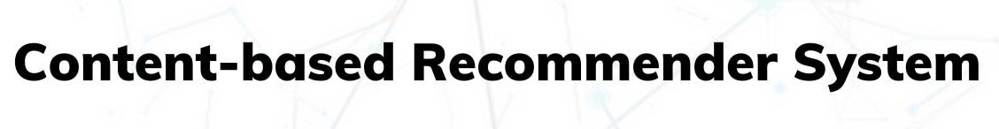

# 📢 E-Learning 

 

This is a **MERN** stack Subscription based Online Learning Platform with content based recommendation system.

 
 

# 🛠️ Tech stack 

## Frontend :

  

## Backend :

   

## Media Management :

## Payment Management :

## Deployed On :

 
 

# 🚀 Features

## Any User

- can search courses with title and filter it with categories.
- can see the top recommended course's title.
- can request course and contact us for feedbacks.
- Register themselves with name, email, password and avatar.

## Registered User

- Can reset their password via mail by selecting forget password and entering their email. 
- Can Log in to website.

## Logged-In User

- Can change their profile info or password.
- Can add or remove courses from their playlist.
- can see the top recommended course's title according to their playlist. 
- Can subscribe (by making payment of Rs 299) to the website for accessing any courses.
- Can logout.

## Subscribed User

- Can access any courses and watch their lectures.
- Can cancel the subscription before 7 days.

## Admin User

- Can has access to Admin dashboard and analyze the stats of everything in real time.
- Can create courses, watch any course's lectures, add or delete lectures in Courses, and delete any courses.
- Can change the user role and delete any user.

